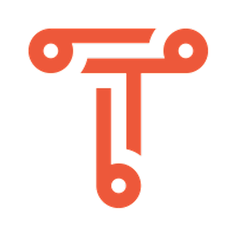

# Cinelab Ontology

The Advene project aims at providing a model and various formats to
share annotations about digital video documents (movies, courses,
conferences…), as well as tools to edit and visualize the hypervideos
generated from both the annotations and the audiovisual documents.
Teachers, moviegoers, etc. can use them to exchange multimedia
comments and analyses about video documents.\n\nThe Cinelab model
allows not only to represent video annotations, but also an
elicitation of their structure (through notions of schema and
annotation type), as well as their presentations with views (templates
applied on data to produce hypervideos) and queries.\n\nThis model has
been developed by the partners of the [Cinelab
project](http://advene.org/cinelab) (2007-2008, funded by the french
national research agency), and used afterwards in a number of projects
and applications, including Advene (LIRIS) and [Ligne de
temps](http://www.iri.centrepompidou.fr/outils/lignes-de-temps/)
([IRI](http://www.iri.centrepompidou.fr)).

## Why are you hosting a copy of this dataset?

We are hosing this vocabulary, since we could not find it anywhere
online anymore.  At the same time, this vocabulary is used in many
Linked Datasets in [YALC](https://github.com/TriplyDB/YALC), so it is
important to have a copy of this vocabulary available.
